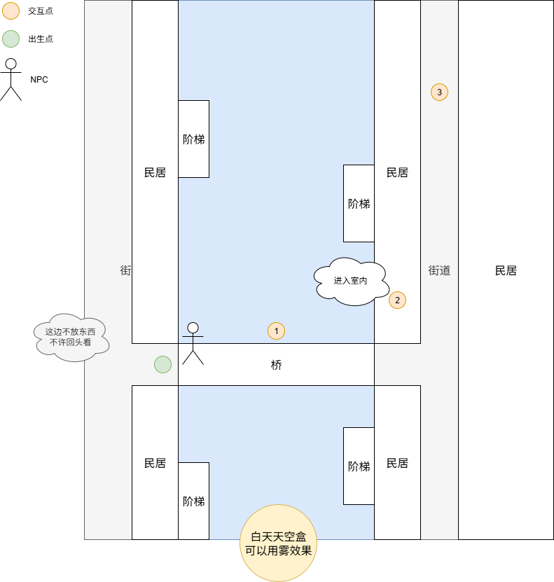
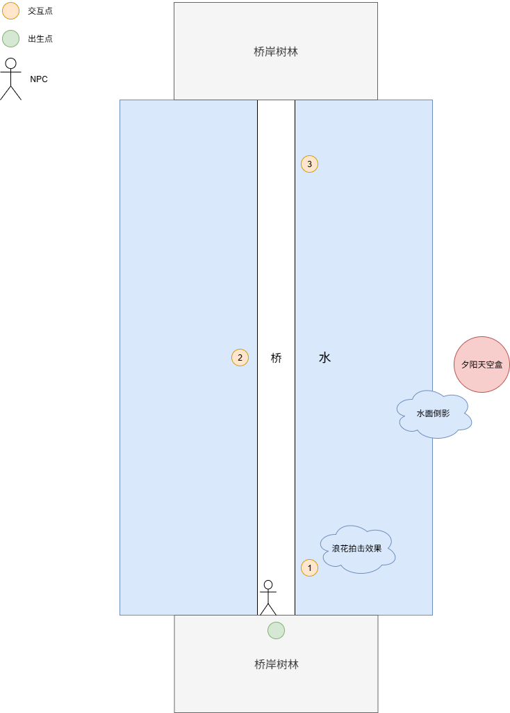
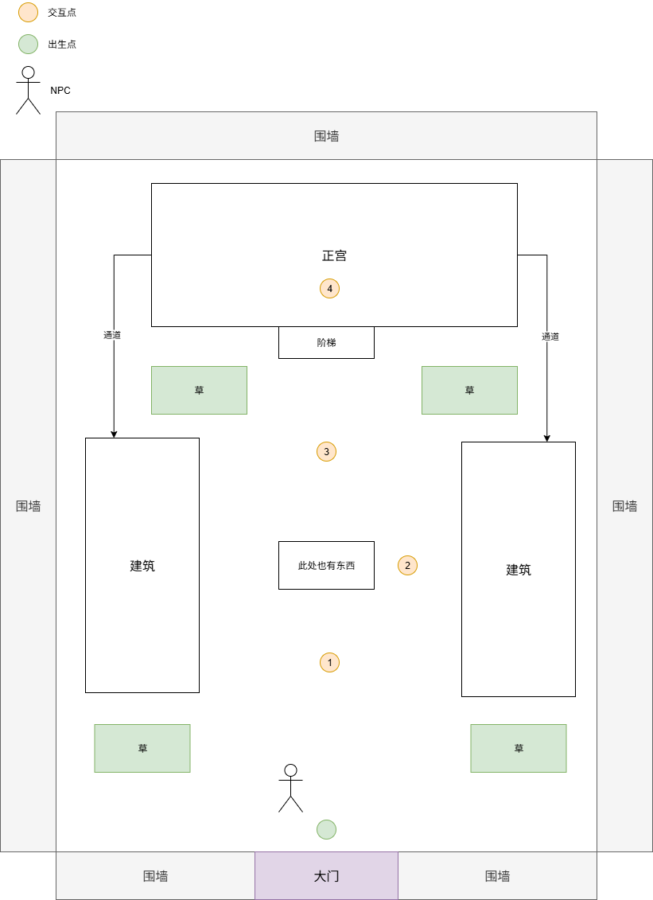
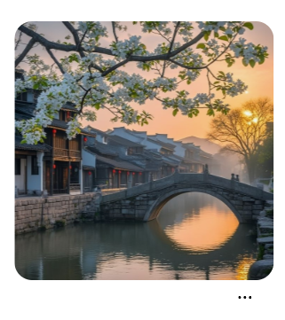

# 2026计设 关卡详细设计

## 第一类小关：探索

### 流程说明

- 第一人称开始，玩家看到委托NPC，上前按E进入对话，NPC简略介绍背景
- 玩家开始探索地图，走到指定交互点时，会提示“按E 吸取灵感”
- 交互后，摄像机混入到定点，特写特定建筑部分，放图片文案说明
    - 这部分的混入可能有多次，也可能黑屏转场
- 完成所有交互点时，提示“灵感齐全”，展现工匠界面，按下“铸造”按钮提示“获得建筑块”，自动进入下一关

### 地图草稿

- 这部分还有待细化，地编可以先搭白盒
- **大伙觉得哪里要改直接拷打我，因为我是个旅游经验很少的死宅……**
- 江南民居（第一大关）
    
    
    
- 桥梁（第二大关）
    
    
    
- 宫殿（第三大关）
    
    
    

## 第二类小关：建造

### 流程说明

- 俯视角开始，画面全屏展示蓝图（让AI整）和建筑块
- 等待五秒后，蓝图缩小到画面左下角，建筑块放到左上角
- 点击建筑块可以获得可放置物，放置在地图中
    - 地图相比探索关卡简洁很多，只放一点相关元素物品，主要集中于画面中心需要建造的建筑
    - 可能建筑一栋也可能建筑多栋
- 放置最后建筑块之后会触发“榫卯构接”环节，切换到榫卯插接小游戏
- 完成榫卯小游戏后，摄像机混入到特写完成后的建筑，展示两秒后，下一关

### 建筑/榫卯类型

- 燕尾榫+江南民居独栋（第一大关）
    - 建筑块：地基/墙壁+山墙/屋顶
- 木桥架构（第二大关）
    - 建筑块：弧形拱/实腹拱/桥面
- 斗拱+宫殿正宫（第三大关）
    - 建筑块：地基/墙壁/柱子/斗拱/屋顶

## 第三类小关：定景

### 流程说明

- 定点视角开始，先展示定点拍摄的一个场景，然后显示出古诗文句子
- 玩家可以点击句子中的某个词语，获得一个可放置物，选择地方并放置
    - 点击时古诗文句子消失，放置后古诗文句子重新显现，直到可选项全部被选完
- 放置完所有事物后，等待两秒钟，画面闪白然后出现定格照（让AI整）

### 分镜设计

- 江南民居（第一大关）
    - 古诗文：过桥灯影参差语，橹声摇碎一川灯/波心荡 冷月无声
        - 提取“灯影”，可以给民居挂上灯笼
        - 提取“橹声”，可以给河水上摆上船
        - 提取“冷月”，可以把天空盒换为夜晚，挂上月亮
    - 分镜参考：
        
        
        
        
        
        
        
- 桥梁（第二大关）
    - 古诗文：落霞与孤鹜齐飞，秋水共长天一色
        - 提取“落霞”，可以把天空盒换为夕阳，挂上落日
        - 提取“孤鹜”，可以给背景加上飞鸟
    - 分镜参考：
        
        正对着桥梁，桥梁背后是夕阳与飞鸟，远处要有群山
        
        没找到很符合的参考图，视角斜对有两张，大伙可以看看怎么样
        
        
        
        
        
- 宫殿（第三大关）
    - 古诗文：瑞雪兆丰年/五步一楼，十步一阁；廊腰缦回，檐牙高啄
        - 提取“雪”，可以给整个画面的物体覆雪
        - 提取“廊腰”/“檐牙”，切换分镜到二号位和三号位
    - 分镜参考：
        
        
        
        
        
        
        
        
        
        
        
        